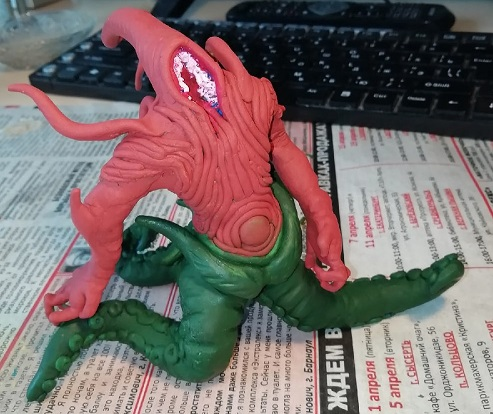
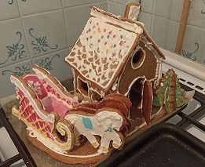

# Приветствую от имени **Kuron13**!

Как человек имеющий **_слишком_** много разных (_очень_ разных) хобби, я всегда открыта к изучению новых дисциплин/инструментов/фактов и т.д.  
Обучение не бывает скучным, если ты заранее знаешь, где применить получаемые знания, а с этим у меня проблем точно нет :D.

А будучи студентом онлайн-академии Нетология, я учусь создавать ещё больше интересных штук!

[](https://netology.ru)

___

## Что ж, а теперь ~~развлечёмся~~ разберёмся с возможностями:

>Внутри напишите любую информацию о себе, добавьте фото.

Возможно, имелось ввиду что-то более личное, но раз уж
>>Используйте возможности Markdown по полной.

то пусть будет так.

- За полтора месяца на курсах был пройдент путь от
   ```
   print('Hello World!')
   ```
   до [целого *сайта*!](https://kuron13.github.io/Site-about-me/) (пусть и не серьёзного)
- Освоено уже довольно много базовых инструментов (аж на нескольких языках)
- И позже будет ещё больше языков программирования и вёрстки!

      Тут вам и Python, и JavaScript, и всякие HTML, CSS, SQL, Markdown.

---
Ещё больше текста! Ещё и в табличках! (бескрайняя любовь к табличкам ~~здорового человека, а не этим~~).
Долго думала чем их заполнить, так что пусть будет хоть что-то.

**Название** |   **Материал**    | **Фото**
:---:|:-----------------:|:---:
Стич |   Свечной воск    | 
Ньярлатотеп |      Пластик      | 
Пряничный домик | Имбирные пряники  | 
Жаль, что центровка по вертикали внутри таблиц работает только в предпросмотре >.<